ALPS - AnaLysis routines for ePigenomicS data
================
Venu Thatikonda
2019-08-23

-   [ALPS-Introduction](#alps-introduction)
    -   [Bigwig files](#bigwig-files)
    -   [Generate bigwig files](#generate-bigwig-files)
    -   [ALPS - workflow](#alps---workflow)
-   [Installation](#installation)
-   [Example usecases with ALPS](#example-usecases-with-alps)
    -   [Calculate enrichments at genomic regions](#calculate-enrichments-at-genomic-regions)
    -   [Perform correlation among replicates/groups](#perform-correlation-among-replicatesgroups)
    -   [Plot enrichments across groups](#plot-enrichments-across-groups)
    -   [Plot UCSC genome browser like plots](#plot-ucsc-genome-browser-like-plots)
    -   [Annotate genomic regions](#annotate-genomic-regions)
    -   [Plot genomic annotations](#plot-genomic-annotations)
    -   [Plot motif representations](#plot-motif-representations)
-   [Acknowledgements](#acknowledgements)
-   [Session info](#session-info)
-   [References](#references)

ALPS-Introduction
=================

**ALPS** (**A**na**L**ysis routines for e**P**igenomic**S** data) is an R package (Venu 2019) that provides tools for the analysis and to produce publication-ready visualizations, mainly aimed at genome-wide epigenomics data, e.g. ChIP-seq, ATAC-seq etc.

Bigwig files
------------

Bigwig files evolved to be a multi-purpose compressed binary format to store genome-wide data at base pair level. Bigwig files are mostly used to store genome-wide quantitative data such as ChIP-seq, ATAC-seq, WGBS, GRO-seq *etc*. Following figure illsutrates the important usecases with bigwig files.

<p align="center">
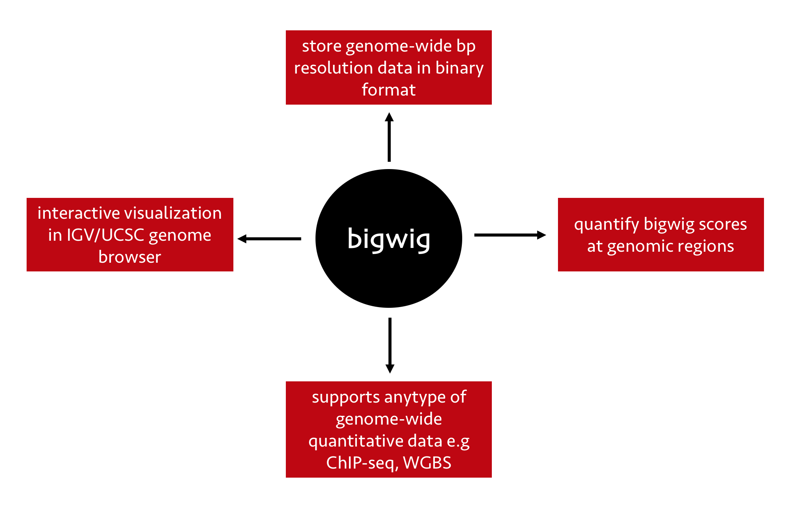
</p>
Generate bigwig files
---------------------

There are multiple ways one can generate bigwig files from BAM files, using [UCSC kent utils](https://genome.ucsc.edu/goldenpath/help/bigWig.html) (ucscGenomeBrowser 2019) or with the [deeptools bamCoverage](https://deeptools.readthedocs.io/en/develop/content/tools/bamCoverage.html) function (Ramírez et al. 2014), which is the easiest way. Once the normalized bigwig files are generated and peaks are identified from BAM files, one would seldom use BAM files again in the entire workflow. The requirements of all downstream processes can be satisified with normalized bigwig files, e.g quantifying normalized read counts at peaks or promoters, visualizing enrichments in genome broswer or igv.

After the peaks are identified, the immediate steps would be to quantify normalized read counts at the identified peaks in order to perform explorative data analysis (EDA), PCA, unsupervised clustering to identify patterns among samples under consideration and generate novel biological insights.

ALPS - workflow
---------------

`ALPS` package is designed in a way to start with a minimal set of input and to reach a rich source of insights from the data. At the most, most functions in `ALPS` require a data table with paths to bigwig files and associated sample meta information. Various functions will utilize this data table and generate downstream outputs. The package produces publication quality visualizations, of which most can be customized within R using `ggplot2` ecosystem.

Following is the overview of the `ALPS` workflow and available functions

<p align="center">

</p>
Installation
============

Install the `ALPS` package with the following code

``` r
devtools::install_github("itsvenu/ALPS")
```

Example usecases with ALPS
==========================

To demonstrate the utility of different functions, `ALPS` package comes with a set of example files that were taken from TCGA consortium's ATAC-seq data from [here](https://gdc.cancer.gov/about-data/publications/ATACseq-AWG) published at (Corces et al. 2018).

Following steps walk you through loading the example data and how to use different function and how to integrate function's output with other R/bioconductor packages to ease the workflow process.

``` r
## load the library

suppressMessages(library(ALPS))
```

Calculate enrichments at genomic regions
----------------------------------------

Most of the explorative analyses in epigenomics starts with quantifying enrichments or methylations at a set of genomic regions e.g. promoter regions or identified peak regions. This quantifications will be used as an input to downstream analyses such as PCA, clustering. The function `multiBigwig_summary` takes sample data table with bigwig paths and corresponding bed file paths calculates enrichments at genomic regions. This function is a wrapper around `rtracklayer` bigwig utilities (Lawrence, Gentleman, and Carey 2009). The function simultaneously generates the consensus peak-set from all the bed files present in input data table before calculating enrichments.

Read data table from `ALPS` package

``` r
chr21_data_table <- system.file("extdata/bw", "ALPS_example_datatable.txt", package = "ALPS", mustWork = TRUE)

## attach path to bw_path and bed_path
d_path <- dirname(chr21_data_table)

chr21_data_table <- read.delim(chr21_data_table, header = TRUE)
chr21_data_table$bw_path <- paste0(d_path, "/", chr21_data_table$bw_path)
chr21_data_table$bed_path <- paste0(d_path, "/", chr21_data_table$bed_path)

chr21_data_table %>% head 
#>   sample_id group color_code
#> 1    ACCx_1  ACCx    #8DD3C7
#> 2    ACCx_2  ACCx    #8DD3C7
#> 3    BRCA_1  BRCA    #FFED6F
#> 4    BRCA_2  BRCA    #FFED6F
#> 5    GBMx_1  GBMx    #B3DE69
#> 6    GBMx_2  GBMx    #B3DE69
#>                                                                                                                                                                 bw_path
#> 1 /Library/Frameworks/R.framework/Versions/3.6/Resources/library/ALPS/extdata/bw/ACCx_025FE5F8_885E_433D_9018_7AE322A92285_X034_S09_L133_B1_T1_PMRG.insertions.chr21.bw
#> 2 /Library/Frameworks/R.framework/Versions/3.6/Resources/library/ALPS/extdata/bw/ACCx_025FE5F8_885E_433D_9018_7AE322A92285_X034_S09_L134_B1_T2_PMRG.insertions.chr21.bw
#> 3 /Library/Frameworks/R.framework/Versions/3.6/Resources/library/ALPS/extdata/bw/BRCA_000CFD9F_ADDF_4304_9E60_6041549E189C_X017_S06_L012_B1_T2_P046.insertions.chr21.bw
#> 4 /Library/Frameworks/R.framework/Versions/3.6/Resources/library/ALPS/extdata/bw/BRCA_01112370_4F6F_4A20_9BE0_7975C3465268_X017_S04_L007_B1_T1_P042.insertions.chr21.bw
#> 5 /Library/Frameworks/R.framework/Versions/3.6/Resources/library/ALPS/extdata/bw/GBMx_09C0DCE7_D669_4D28_980D_BF71179116A4_X008_S01_L001_B1_T1_P017.insertions.chr21.bw
#> 6 /Library/Frameworks/R.framework/Versions/3.6/Resources/library/ALPS/extdata/bw/GBMx_09C0DCE7_D669_4D28_980D_BF71179116A4_X008_S01_L002_B1_T2_P020.insertions.chr21.bw
#>                                                                                    bed_path
#> 1 /Library/Frameworks/R.framework/Versions/3.6/Resources/library/ALPS/extdata/bw/ACCx_1.bed
#> 2 /Library/Frameworks/R.framework/Versions/3.6/Resources/library/ALPS/extdata/bw/ACCx_2.bed
#> 3 /Library/Frameworks/R.framework/Versions/3.6/Resources/library/ALPS/extdata/bw/BRCA_1.bed
#> 4 /Library/Frameworks/R.framework/Versions/3.6/Resources/library/ALPS/extdata/bw/BRCA_2.bed
#> 5 /Library/Frameworks/R.framework/Versions/3.6/Resources/library/ALPS/extdata/bw/GBMx_1.bed
#> 6 /Library/Frameworks/R.framework/Versions/3.6/Resources/library/ALPS/extdata/bw/GBMx_2.bed
```

Now run the function `multiBigwig_summary` to calculate enrichments from all bigwig files by simultaneosly preparing consensus peak-set from all bed files in the column `bed_path`

``` r
enrichments <- multiBigwig_summary(data_table = chr21_data_table, 
                                   summary_type = "mean", 
                                   parallel = FALSE)

enrichments %>% head
#>     chr    start      end      ACCx_1       ACCx_2    BRCA_1    BRCA_2
#> 1 chr21 45639550 45640549   3.4293169   4.30173375  6.229088  6.053632
#> 2 chr21 45640994 45641493   5.1058709   4.39355741  2.412814  3.262252
#> 3 chr21 45642859 45643914 118.9869371 132.23839670 63.987536 82.130318
#> 4 chr21 45668163 45668662   0.3810360   0.02440864  4.359150  1.732686
#> 5 chr21 45689906 45690405   0.4229491   0.81362319  2.638012  0.923278
#> 6 chr21 45698386 45698910  46.5824657  54.70859597  1.141300  1.746901
#>       GBMx_1    GBMx_2     LGGx_1     LGGx_2
#> 1  6.2633310  8.964782  8.0253673  6.3168158
#> 2  6.2341950  5.569840  2.2929616  4.2814719
#> 3 23.8171352 29.146589 57.2475263 50.2498071
#> 4  0.6438128  1.015109  0.8307302  0.9188698
#> 5  1.1011821  0.723354  2.4658742  1.0604877
#> 6 24.9284784 21.264368  2.8639639  2.1893534
```

With little teaking, the output from `multiBigwig_summary` can be very easily integrated with other R/bioconductor packages for explorative analysis, PCA or clustering.

The function `get_variable_regions` takes the output of `multiBigwig_summary` or a similar format and returns a `n` number of scaled variable regions, which can directly be used with tools such as [`ComplexHeatmap`](https://bioconductor.org/packages/release/bioc/html/ComplexHeatmap.html) (Gu, Eils, and Schlesner 2016).

Following is an example on how to integrate `multiBigwig_summary` output to `ComplexHeatmap` via `get_variable_regions`

``` r
enrichments_matrix <- get_variable_regions(enrichments_df = enrichments,
                                           log_transform = TRUE,
                                           scale = TRUE,
                                           num_regions = 100)
  
suppressPackageStartupMessages(require(ComplexHeatmap))
suppressPackageStartupMessages(require(circlize))

Heatmap(enrichments_matrix, name = "enrichments",
    col = colorRamp2(c(-1, 0, 1), c("green", "white", "red")),
    show_row_names = FALSE, 
    show_column_names = TRUE, 
    show_row_dend = FALSE,
    column_names_gp =  gpar(fontsize = 8))
```

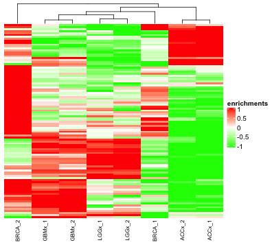

Perform correlation among replicates/groups
-------------------------------------------

It is often of high interest in genome-wide quantitative data to check the correlations among replicates within a subgroup to identify specific patterns in the data. `plot_correlation` function is designed for such use cases. The function is compatible with the output of `multiBigwig_summary` and also with other tools output with similar format

``` r

plot_correlation(enrichments_df = enrichments, 
                 log_transform = TRUE, 
                 plot_type = "replicate_level", 
                 sample_metadata = chr21_data_table)
```

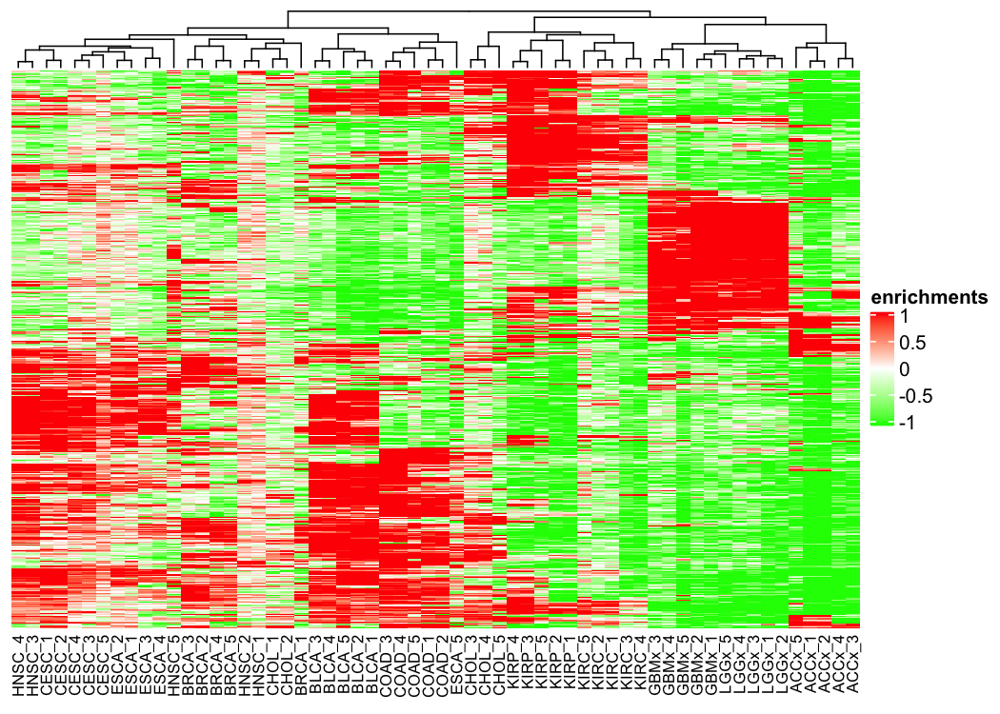

Instead of correlations of replicates within and across groups, one can also do group level correlations after averaging all samples within a group. The argument `plot_type = "group_level"` in `plot_correlation` exactly does this.

``` r
## group_level
plot_correlation(enrichments_df = enrichments, 
                 log_transform = TRUE, 
                 plot_type = "group_level", 
                 sample_metadata = chr21_data_table)
```

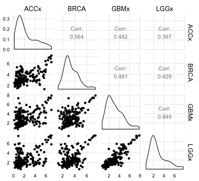

Either `replicate_level` or `group_level` plot appearance can be further modified with arguments that passed to [`corrplot::corrplot`](https://cran.r-project.org/web/packages/corrplot/vignettes/corrplot-intro.html) or [`GGally::ggpairs`](https://ggobi.github.io/ggally/#ggallyggpairs) respectively.

Plot enrichments across groups
------------------------------

Once the group-specific genomic regions (or peaks) identified with various differential enrichments packages, e.g. DESeq2, diffBind, QSEA, one would be interested to visualize enrichment qunatities across all samples of all groups to show magnitude of differnce in enrichments. `plot_enrichments` function takes a data.frame of enrichments, either the output from `multiBigwig_summary` or a similar format and plots enrichments in a combination of box and violin plots. The function utilizes the slightly modified version of the code published at (Allen M 2018). There are two ways one can plot enrichment differences, one way is to directly plot group level enrichments after averaging all samples within a group for each region and the other way is plotting paired conditions for each group, e.g. untreated, treated enrichments for a transcription factor. In both cases function needs a `sample_metadata` table along with the `enrichments` data.frame.

Following example illustrates the uses of `plot_enrichments` function uses in different settings. If `plot_type = "separate"`, function plots group level enrichments

``` r
## plot_type == "separate"

plot_enrichments(enrichments_df = enrichments, 
                 log_transform = TRUE, 
                 plot_type = "separate", 
                 sample_metadata = chr21_data_table)
```

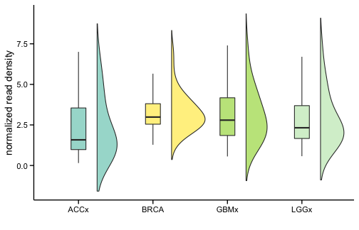

If `plot_type = "overlap"`, function plots box plots along with overlap violins to show the distributions in paired conditions. The `sample_metadata` for these plots require one more additional column which describes sample status. See the following example

``` r
## plot_type == "overlap"

enrichemnts_4_overlapviolins <- system.file("extdata/overlap_violins",
                                      "enrichemnts_4_overlapviolins.txt",
                                      package = "ALPS", mustWork = TRUE)
enrichemnts_4_overlapviolins <- read.delim(enrichemnts_4_overlapviolins, header = TRUE)

## metadata associated with above enrichments

data_table_4_overlapviolins <- system.file("extdata/overlap_violins",
                                        "data_table_4_overlapviolins.txt",
                                        package = "ALPS", mustWork = TRUE)
data_table_4_overlapviolins <- read.delim(data_table_4_overlapviolins, header = TRUE)

## enrichments table
enrichemnts_4_overlapviolins %>% head
#>     chr   start     end         s1        s2         s3        s4
#> 1 chr21 5101659 5102227 0.25526578 0.4611994 0.21438043 0.1573575
#> 2 chr21 5128223 5128741 0.82057469 0.9359073 0.66987324 0.8718381
#> 3 chr21 5154593 5155112 0.80378039 0.8452937 0.61775645 0.5620449
#> 4 chr21 5220488 5221005 0.04583463 0.7161867 0.04999978 0.5506898
#> 5 chr21 5221136 5221912 0.87553172 0.1238063 0.94939878 0.5923653
#> 6 chr21 5223327 5223826 0.12800909 0.5948275 0.58255203 0.7278129
#>            s5        s6          s7        s8
#> 1 -0.05081961 0.5747147  0.56832485 0.3590694
#> 2  0.31443426 1.1137688 -0.20168400 0.8110701
#> 3  0.29282731 0.8309985 -0.04550986 0.9127605
#> 4  0.41634277 0.8684639  0.37864897 0.3802162
#> 5  0.24742289 0.3206298 -0.13936118 0.7587155
#> 6 -0.14432328 0.3536091  0.48731594 0.8615313

## metadata table
data_table_4_overlapviolins %>% head
#>   bw_path sample_id sample_status group color_code
#> 1 path.bw        s1     untreated   tf1       gray
#> 2 path.bw        s2     untreated   tf2       gray
#> 3 path.bw        s3     untreated   tf1       gray
#> 4 path.bw        s4     untreated   tf2       gray
#> 5 path.bw        s5       treated   tf1        red
#> 6 path.bw        s6       treated   tf2        red
```

``` r
plot_enrichments(enrichments_df = enrichemnts_4_overlapviolins,
                 log_transform = FALSE,
                 plot_type = "overlap", 
                 sample_metadata = data_table_4_overlapviolins,
                 overlap_order = c("untreated", "treated"))
```

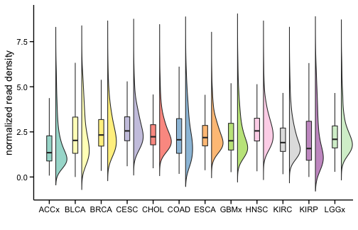

There are additional arguments available for both `separate` and `overlap` to modify the appearance (please check `?plot_enrichments`), moreover the function returns a `ggplot2` object which enables the user to change additional components of the plot.

Plot UCSC genome browser like plots
-----------------------------------

In any genome-wide epigenomic analyses, it is often interesting to check enrichments at certain genomic loci, e.g. various histone modifications at a genomic region that define a chromatin state or co-binding of different transcription factors at a promoter or enhancer element. The classical way to acheive this task is to load all bigwig files into IGV or create a data hub at UCSC and navigate to the region of interest. This is not always practical and needs a substantial manual effort, in addition one requires a UCSC genome browser server in order to get this task done with the unpublished data.

To circumvent this problem, several R/bioconductor packages were designed (e.g. `Gviz`, `karyoploteR`). Even within R environment, one needs to put a significant effort to create UCSC genome browser like figures. The function `plot_broswer_tracks` in `ALPS` package requires a minimal input of a data table and a genomic region and produces a publication quality browser like plot. The function uses utilities within `Gviz` package to generate the visualizations (Hahne and Ivanek 2016).

Following code snippet illustrates how one can use this function

``` r
## gene_range
gene_range = "chr21:45643725-45942454"

plot_browser_tracks(data_table = chr21_data_table,
                    gene_range = gene_range, 
                    ref_gen = "hg38")
```

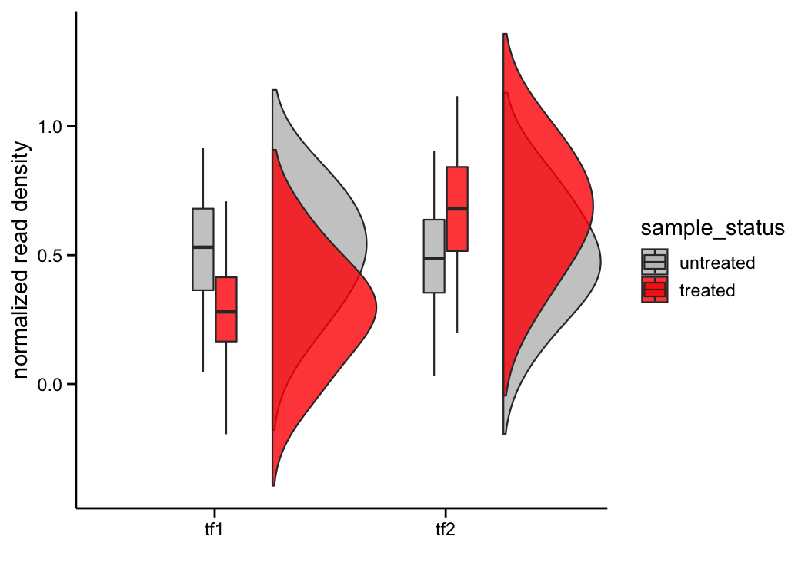

Annotate genomic regions
------------------------

One of the usual tasks in genome-wide epigenomic analyses is to identify the genomic locations of peaks/binding sites. This gives an overview of where a particular transcription factor frequently binds or where a particular type of histone modifications are observed. The function `get_genomic_annotations` utilizes the above data table and returns the percentage of peaks or binding sites found in each of the genomic features such as promoters, UTRs, intergenetic regions etc. This function is a wrapper around `ChIPseeker`'s `annotatePeak` function (Yu, Wang, and He 2015).

Function also offers an option with `merge_level` to merge overlaping peaks from different samples at different levels.

-   `all` creates a consensus peak set by merging overlaping peaks from all samples present in the `data_table`
-   `group_level` creates a group level consensus peak set. Meaning overlaping peaks from all samples of each group will be merged
-   `none` does not create any consensus peak set. Per-sample genomic annotations will be returned

``` r

g_annotations <- get_genomic_annotations(data_table = chr21_data_table,
                                         ref_gen = "hg38",
                                         tss_region = c(-1000, 1000),
                                         merge_level = "group_level")

g_annotations %>% head
#>      Feature      ACCx       BRCA      GBMx      LGGx
#> 1   Promoter 45.762712 31.2977099 41.666667 41.666667
#> 2     5' UTR  1.694915  0.7633588        NA        NA
#> 3     3' UTR  6.779661  3.8167939  6.250000  5.000000
#> 4   1st Exon  1.694915  1.5267176  4.166667  5.000000
#> 5 Other Exon  8.474576  9.1603053  6.250000  6.666667
#> 6 1st Intron  5.084746  3.0534351        NA  3.333333
```

Plot genomic annotations
------------------------

The results returned from `get_genomic_annotations` can directly be passed to the function `plot_genomic_annotations` to visualize the percentages of peaks in each feature. The function can produce visualizations either as bar plot or heatmap

``` r
plot_genomic_annotations(annotations_df = g_annotations, plot_type = "heatmap")
```

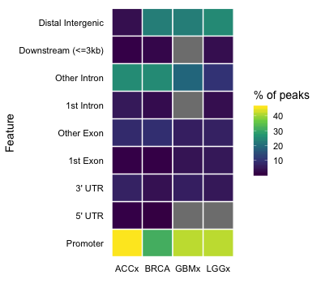

``` r
plot_genomic_annotations(annotations_df = g_annotations, plot_type = "bar")
#> Warning: Removed 4 rows containing missing values (position_stack).
```

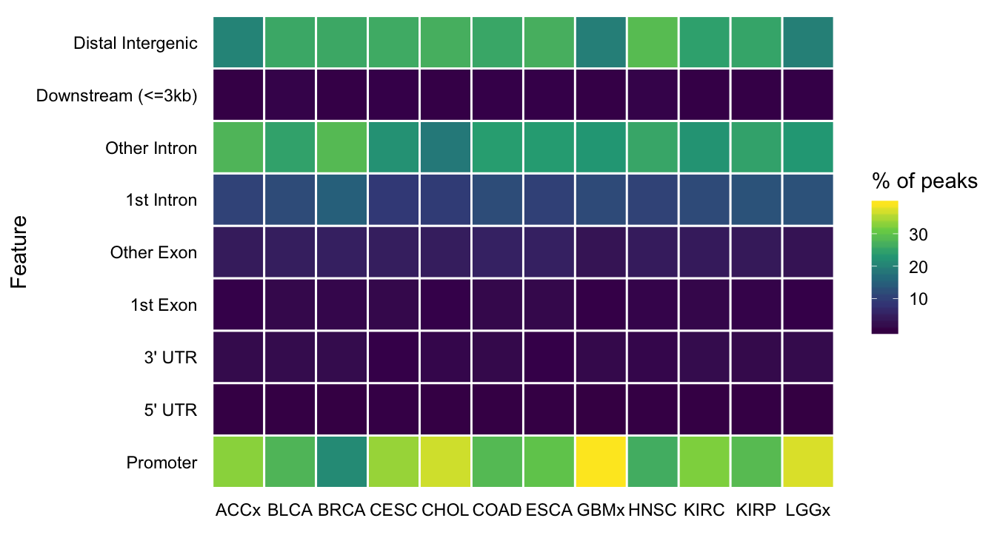

Plot motif representations
--------------------------

Transcription factors bind to DNA sequences with particular nucleotide stretches. A collection of all binding sites for a transcription factor can be represented by a sequence motif. Typically, transcription factor enrichment analyses utilizes these motif information and provide whether a given transcription factor is enriched in a given set of genomic regions, e.g. enhancers. Currently, there are number of different databases which provide transcription factor motifs in very different format. The function `plot_motif_logo` takes input from various databases e.g. MEME, TRANSFAC, JASPAR, HOMER or a simple PFM and plots binding site representations either as a sequence logo or a barplot. Barplot representation has a several advantages over sequence logo which are described [here](http://www.ensembl.info/2018/10/15/new-ensembl-motif-features/). The logo plot utilizes the function `ggseqlogo` from [`ggseqlogo`](https://github.com/omarwagih/ggseqlogo) package (Wagih 2017).

Following example illustrates how to use the function to plot motif representations

``` r
myc_transfac <- system.file("extdata/motifs", "MA0147.2.transfac", package = "ALPS", mustWork = TRUE)

## bar plot

plot_motif_logo(motif_path = myc_transfac, 
                database = "transfac", 
                plot_type = "bar")
```

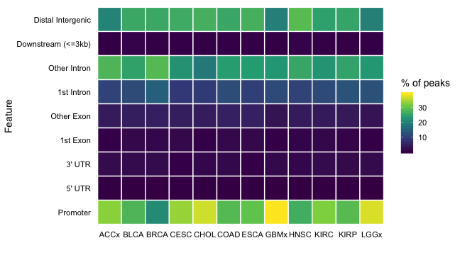

``` r

## logo plot
plot_motif_logo(motif_path = myc_transfac, 
                database = "transfac", 
                plot_type = "logo")
```

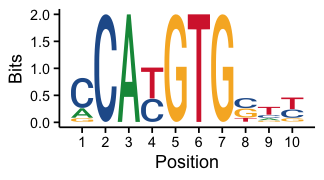

Acknowledgements
================

`ALPS` package benefited suggestions from

-   Gyan Prakash Mishra, Institute of Life Sciences
-   [Kevin Blighe](https://www.biostars.org/u/41557), Visiting professor
-   Devon P Ryan, Max Plank Institute of Immunobiology and Epigenetics
-   Michael Fletcher, DKFZ/German Cancer Research Center
-   [Sequence logo as barplot](https://stackoverflow.com/questions/1611215/remove-a-git-commit-which-has-not-been-pushed)

Session info
============

``` r
sessionInfo()
#> R version 3.6.0 (2019-04-26)
#> Platform: x86_64-apple-darwin15.6.0 (64-bit)
#> Running under: macOS High Sierra 10.13.6
#> 
#> Matrix products: default
#> BLAS:   /Library/Frameworks/R.framework/Versions/3.6/Resources/lib/libRblas.0.dylib
#> LAPACK: /Library/Frameworks/R.framework/Versions/3.6/Resources/lib/libRlapack.dylib
#> 
#> locale:
#> [1] en_US.UTF-8/en_US.UTF-8/en_US.UTF-8/C/en_US.UTF-8/en_US.UTF-8
#> 
#> attached base packages:
#> [1] grid      stats     graphics  grDevices utils     datasets  methods  
#> [8] base     
#> 
#> other attached packages:
#> [1] circlize_0.4.6       ComplexHeatmap_2.0.0 ALPS_0.99.0         
#> 
#> loaded via a namespace (and not attached):
#>   [1] tidyselect_0.2.5                       
#>   [2] RSQLite_2.1.1                          
#>   [3] AnnotationDbi_1.46.0                   
#>   [4] htmlwidgets_1.3                        
#>   [5] BiocParallel_1.18.0                    
#>   [6] munsell_0.5.0                          
#>   [7] miniUI_0.1.1.1                         
#>   [8] colorspace_1.4-1                       
#>   [9] GOSemSim_2.10.0                        
#>  [10] Biobase_2.44.0                         
#>  [11] TxDb.Hsapiens.UCSC.hg38.knownGene_3.4.6
#>  [12] knitr_1.23                             
#>  [13] rstudioapi_0.10                        
#>  [14] stats4_3.6.0                           
#>  [15] DOSE_3.10.2                            
#>  [16] labeling_0.3                           
#>  [17] urltools_1.7.3                         
#>  [18] GenomeInfoDbData_1.2.1                 
#>  [19] polyclip_1.10-0                        
#>  [20] bit64_0.9-7                            
#>  [21] farver_1.1.0                           
#>  [22] vctrs_0.2.0                            
#>  [23] xfun_0.8                               
#>  [24] biovizBase_1.32.0                      
#>  [25] ggseqlogo_0.1                          
#>  [26] R6_2.4.0                               
#>  [27] GenomeInfoDb_1.20.0                    
#>  [28] clue_0.3-57                            
#>  [29] pals_1.5                               
#>  [30] AnnotationFilter_1.8.0                 
#>  [31] manipulateWidget_0.10.0                
#>  [32] bitops_1.0-6                           
#>  [33] reshape_0.8.8                          
#>  [34] fgsea_1.10.0                           
#>  [35] gridGraphics_0.4-1                     
#>  [36] DelayedArray_0.10.0                    
#>  [37] assertthat_0.2.1                       
#>  [38] promises_1.0.1                         
#>  [39] scales_1.0.0                           
#>  [40] ggraph_1.0.2                           
#>  [41] nnet_7.3-12                            
#>  [42] enrichplot_1.4.0                       
#>  [43] gtable_0.3.0                           
#>  [44] ensembldb_2.8.0                        
#>  [45] rlang_0.4.0                            
#>  [46] zeallot_0.1.0                          
#>  [47] genefilter_1.66.0                      
#>  [48] GlobalOptions_0.1.0                    
#>  [49] splines_3.6.0                          
#>  [50] rtracklayer_1.44.0                     
#>  [51] lazyeval_0.2.2                         
#>  [52] acepack_1.4.1                          
#>  [53] dichromat_2.0-0                        
#>  [54] europepmc_0.3                          
#>  [55] checkmate_1.9.3                        
#>  [56] rgl_0.100.26                           
#>  [57] yaml_2.2.0                             
#>  [58] reshape2_1.4.3                         
#>  [59] GenomicFeatures_1.36.0                 
#>  [60] crosstalk_1.0.0                        
#>  [61] backports_1.1.4                        
#>  [62] httpuv_1.5.1                           
#>  [63] qvalue_2.16.0                          
#>  [64] Hmisc_4.2-0                            
#>  [65] tools_3.6.0                            
#>  [66] ggplotify_0.0.3                        
#>  [67] gridBase_0.4-7                         
#>  [68] ggplot2_3.2.1                          
#>  [69] gplots_3.0.1.1                         
#>  [70] RColorBrewer_1.1-2                     
#>  [71] BiocGenerics_0.30.0                    
#>  [72] ggridges_0.5.1                         
#>  [73] Rcpp_1.0.2                             
#>  [74] plyr_1.8.4                             
#>  [75] base64enc_0.1-3                        
#>  [76] progress_1.2.2                         
#>  [77] zlibbioc_1.30.0                        
#>  [78] purrr_0.3.2                            
#>  [79] RCurl_1.95-4.12                        
#>  [80] prettyunits_1.0.2                      
#>  [81] rpart_4.1-15                           
#>  [82] GetoptLong_0.1.7                       
#>  [83] viridis_0.5.1                          
#>  [84] cowplot_0.9.4                          
#>  [85] S4Vectors_0.22.0                       
#>  [86] SummarizedExperiment_1.14.0            
#>  [87] ggrepel_0.8.1                          
#>  [88] cluster_2.0.9                          
#>  [89] magrittr_1.5                           
#>  [90] data.table_1.12.2                      
#>  [91] DO.db_2.9                              
#>  [92] triebeard_0.3.0                        
#>  [93] ProtGenerics_1.16.0                    
#>  [94] matrixStats_0.54.0                     
#>  [95] hms_0.5.0                              
#>  [96] mime_0.7                               
#>  [97] evaluate_0.14                          
#>  [98] xtable_1.8-4                           
#>  [99] XML_3.98-1.20                          
#> [100] IRanges_2.18.0                         
#> [101] gridExtra_2.3                          
#> [102] shape_1.4.4                            
#> [103] compiler_3.6.0                         
#> [104] biomaRt_2.40.0                         
#> [105] tibble_2.1.3                           
#> [106] maps_3.3.0                             
#> [107] KernSmooth_2.23-15                     
#> [108] crayon_1.3.4                           
#> [109] htmltools_0.3.6                        
#> [110] later_0.8.0                            
#> [111] Formula_1.2-3                          
#> [112] tidyr_0.8.3                            
#> [113] DBI_1.0.0                              
#> [114] tweenr_1.0.1                           
#> [115] corrplot_0.84                          
#> [116] ChIPseeker_1.20.0                      
#> [117] MASS_7.3-51.4                          
#> [118] boot_1.3-22                            
#> [119] Matrix_1.2-17                          
#> [120] gdata_2.18.0                           
#> [121] parallel_3.6.0                         
#> [122] Gviz_1.28.0                            
#> [123] igraph_1.2.4.1                         
#> [124] GenomicRanges_1.36.0                   
#> [125] pkgconfig_2.0.2                        
#> [126] TxDb.Hsapiens.UCSC.hg19.knownGene_3.2.2
#> [127] rvcheck_0.1.3                          
#> [128] GenomicAlignments_1.20.0               
#> [129] foreign_0.8-71                         
#> [130] xml2_1.2.0                             
#> [131] annotate_1.62.0                        
#> [132] webshot_0.5.1                          
#> [133] XVector_0.24.0                         
#> [134] stringr_1.4.0                          
#> [135] VariantAnnotation_1.30.1               
#> [136] digest_0.6.20                          
#> [137] Biostrings_2.52.0                      
#> [138] rmarkdown_1.14                         
#> [139] fastmatch_1.1-0                        
#> [140] htmlTable_1.13.1                       
#> [141] curl_4.0                               
#> [142] shiny_1.3.2                            
#> [143] Rsamtools_2.0.0                        
#> [144] gtools_3.8.1                           
#> [145] rjson_0.2.20                           
#> [146] jsonlite_1.6                           
#> [147] mapproj_1.2.6                          
#> [148] viridisLite_0.3.0                      
#> [149] BSgenome_1.52.0                        
#> [150] pillar_1.4.2                           
#> [151] lattice_0.20-38                        
#> [152] GGally_1.4.0                           
#> [153] httr_1.4.0                             
#> [154] plotrix_3.7-5                          
#> [155] survival_2.44-1.1                      
#> [156] GO.db_3.8.2                            
#> [157] glue_1.3.1                             
#> [158] UpSetR_1.4.0                           
#> [159] png_0.1-7                              
#> [160] bit_1.1-14                             
#> [161] ggforce_0.3.0                          
#> [162] stringi_1.4.3                          
#> [163] blob_1.1.1                             
#> [164] org.Hs.eg.db_3.8.2                     
#> [165] latticeExtra_0.6-28                    
#> [166] caTools_1.17.1.2                       
#> [167] memoise_1.1.0                          
#> [168] dplyr_0.8.3
```

References
==========

Allen M, Whitaker K, Poggiali D. 2018. “Raincloud plots: a multi-platform tool for robust data visualization.” *PeerJ Preprints 6:e27137v1*.

Corces, M. Ryan, Jeffrey M. Granja, Shadi Shams, Bryan H. Louie, Jose A. Seoane, Wanding Zhou, Tiago C. Silva, et al. 2018. “The Chromatin Accessibility Landscape of Primary Human Cancers.” Edited by Rehan Akbani, Christopher C. Benz, Evan A. Boyle, Bradley M. Broom, Andrew D. Cherniack, Brian Craft, John A. Demchok, et al. *Science* 362 (6413). American Association for the Advancement of Science. doi:[10.1126/science.aav1898](https://doi.org/10.1126/science.aav1898).

Gu, Zuguang, Roland Eils, and Matthias Schlesner. 2016. “Complex heatmaps reveal patterns and correlations in multidimensional genomic data.” *Bioinformatics* 32 (18): 2847–9. doi:[10.1093/bioinformatics/btw313](https://doi.org/10.1093/bioinformatics/btw313).

Hahne, Florian, and Robert Ivanek. 2016. “Visualizing Genomic Data Using Gviz and Bioconductor.” In *Statistical Genomics: Methods and Protocols*, edited by Sean Mathé Ewyand Davis, 335–51. New York, NY: Springer New York. doi:[10.1007/978-1-4939-3578-9\_16](https://doi.org/10.1007/978-1-4939-3578-9_16).

Lawrence, Michael, Robert Gentleman, and Vincent Carey. 2009. “rtracklayer: an R package for interfacing with genome browsers.” *Bioinformatics* 25 (14): 1841–2. doi:[10.1093/bioinformatics/btp328](https://doi.org/10.1093/bioinformatics/btp328).

Ramírez, Fidel, Friederike Dündar, Sarah Diehl, Björn A. Grüning, and Thomas Manke. 2014. “deepTools: a flexible platform for exploring deep-sequencing data.” *Nucleic Acids Research* 42 (W1): W187–W191. doi:[10.1093/nar/gku365](https://doi.org/10.1093/nar/gku365).

ucscGenomeBrowser. 2019. “UCSC Genome Browser source tree.” <https://github.com/ucscGenomeBrowser/kent>.

Venu, Thatikonda. 2019. “ALPS: AnaLysis routines for ePigenomicS data.” <https://github.com/itsvenu>.

Wagih, Omar. 2017. “ggseqlogo: a versatile R package for drawing sequence logos.” *Bioinformatics* 33 (22): 3645–7. doi:[10.1093/bioinformatics/btx469](https://doi.org/10.1093/bioinformatics/btx469).

Yu, Guangchuang, Li-Gen Wang, and Qing-Yu He. 2015. “ChIPseeker: An R/Bioconductor Package for Chip Peak Annotation, Comparison and Visualization.” *Bioinformatics* 31 (14): 2382–3. doi:[10.1093/bioinformatics/btv145](https://doi.org/10.1093/bioinformatics/btv145).
